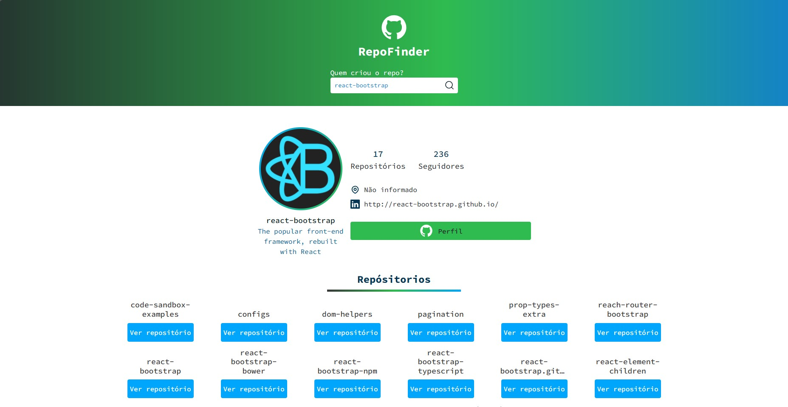

# RepoFinder

Lista o perfil e repositórios dos usuários do GitHub, utilizando a API do GitHub.


## Veja esse projeto online

[Visualizar RepoFinder no netlify]([https://awesomeopensource.com/project/elangosundar/awesome-README-templates](https://65fde94dd91cb4000848b798--repofinder164768.netlify.app/))


## Rodando localmente

Clone o projeto

```bash
  git clone https://github.com/IsraelBarbosa/repo-finder.git
```

Entre no diretório do projeto

```bash
  cd repo-finder
```

Instale as dependências

```bash
  npm install
```

Inicie o servidor

```bash
  npm run start
```


## Screenshots




## Stack utilizada

* React
* TypeScript
* styled-components
* Bootstrap 5


## Aprendizados

* Lifting State Up do react
* React com typeScript
* Utilizar um hook customizado
* Renderização condicional
* Promise.all do javaScript
* Usar o styled-components
* Usar o bootstrap 5
* Uso da unidade de medida REM


## Funcionalidades

- Visualize o perfil dos usuários do GitHub

